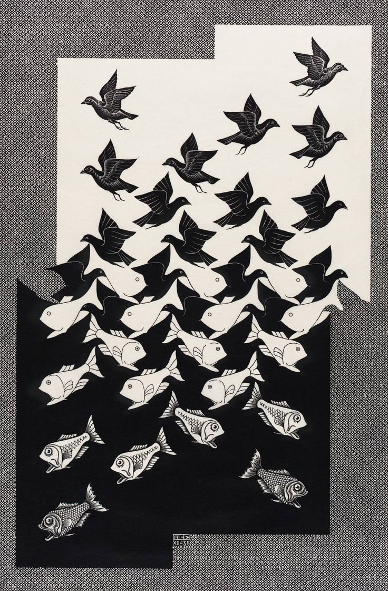

+++
date = 2024-03-28T17:29:05-03:00
toc = false
+++

$ whoami

 
 

    

        
Computer Science BSc., graduated from the <a href="https://www.ufscar.br/">Federal University of São Carlos</a> in 2022, I've worked as a Data Scientist in various scenarios such as data analysis, data modeling, software development in data and machine learning pipelines, designing and builing software tools and workflow automation/orchestration.

        
Although most of my effort is centered around Artificial Intelligence, I also enjoy studying and working on topics such as process automatization, software development, IoT, renewable energy, stock market, linguistics, astronomy and contributing to open-source projects.

         
        
<i>The best way to predict the future is to invent it.</i> — <b>Alan C. Kay</b>

         
        
            
            
            
            
        
    

    

        <figure>
        
        <figcaption><i>"Sky and Water II"</i> by M. C. Escher (lithography, 1938)</figcaption>
        </figure>
    

