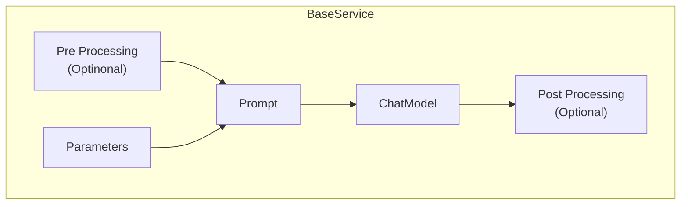
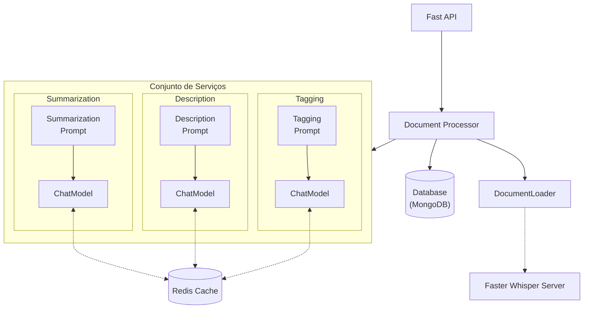

+++
title = 'Langchain Document Processor'
date = 2024-09-15
type = 'docs'
+++

## Introduction

Building on top of the previous [Langchain Summarization App]() and [Summarization Suite]() projects,
the Lanchghain Document Processor expands beyond summarization, incorporating additional services
for description, tagging key-point extraction and translation. While retaining the core principles
of modularity, the project has evolved to accommodate broader functionalities, improved execution
flexibility and refined the storage strategy.


  


## Document Services

To extend the functionality of the application, the summarization logic was abstracted into a
reusable BaseService class. This abstraction allows new tasks—such as translation, tagging, or
summarization—to be implemented seamlessly as individual services while leveraging shared mechanisms
like parameter handling and propagation.

Each BaseService subclass represents an atomic unit of processing and typically consists of:

- A Prompt: Defines the task-specific instructions.
- A ChatModel: Drives the execution using a chosen language model.
- Optional Processing Steps: Post- or pre-processing operations tailored to the service's needs.

While these are the core components, additional elements can be integrated as long as they
conform to the base interface.

By adhering to this design, services remain modular and flexible. Each service can operate as a
standalone processing task over a single document or a batch of documents. Service execution
generates its own set of metadata, which is then stored alongside the processed document in the
storage system, ensuring traceability and data integrity.

## Architecture

