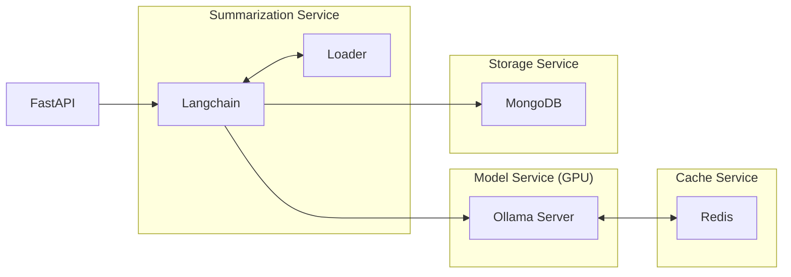
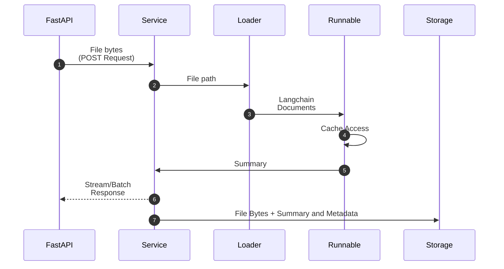

+++
title = 'Langchain Summarization App'
date = 2024-09-15
type = 'docs'
+++


## Introduction

After the discoveries and insights from the [Summarization Suite](summarization-suite/_index.md), I
developed a more robust system in order to combine summarization capabilities across text, audio and video
formats in a single application, this time deployed as an API service.

In this project the different summarization operations performed over different the media formats
were combined using the [Langchain](https://github.com/langchain-ai/langchain) framework along with
many of its integrations with other services and libraries. The final solution consisted of a RESTful
API served via FastAPI with batching/streaming capabilities interacting with a micro-service-based
system deployed in Podman containers. Additionally, all LLM operations, including summarization tasks
were run locally within GPU-capable containers.

Apart from the summarization operations, a simple Feedback machanism was implemented to collect
via the REST API feedbacks for the generated summaries.



  


### Highlights
- [Podman](https://github.com/containers/podman) as container engine for micro-service based deployment
- Streaming capabilities directly via Langchain
- LLM deployment with [Ollama](https://github.com/ollama/ollama) in GPU capable containers (powered by [nvidia container toolkit](https://docs.nvidia.com/datacenter/cloud-native/container-toolkit/latest/index.html))
- [Redis](https://github.com/redis/redis) for LLM response caching
- [MongoDB](https://github.com/mongodb/mongo) for storage solution, storing summaries, metadata and feedbacks
- [FastAPI](https://github.com/fastapi/fastapi) as web framework


## Input Formats

The two main formats processed by the application include text and audio. Langchain makes it easy to
extract the content, in this case text, of a myriad of file formats using its [Document Loaders](https://python.langchain.com/docs/concepts/document_loaders/)
, which act as an initial step in the processing pipeline. The Summarization Service class dynamically
selects the appropriate Loader based on the file type, identified using `libmagic`. Consequently,
**all files submitted to the service are uploaded as raw binary data**.

Below is an example of an API call in which some file `file.pdf` is uploaded to appropriate endpoint
using a POST request.

```bash
$ curl -X POST "http://0.0.0.0:8000/summarize"
    \ -F "file=@file.pdf;type=application/octet-stream"
    \ --no-buffer
```



In addition to Langchain’s built-in Loaders, a custom Document Loader for audio transcription has
been proposed (currently under review in a [PR for the `langchain-community` package](https://github.com/langchain-ai/langchain/pull/26638)).
This PR provides further details and rationale for the integration. For now, suffices to know 
that audio transcription is handled locally but operates independently of the summarization
environment.


## Architecture



### Componentes and Containers

### Execution Flow



## Streaming & Batching

