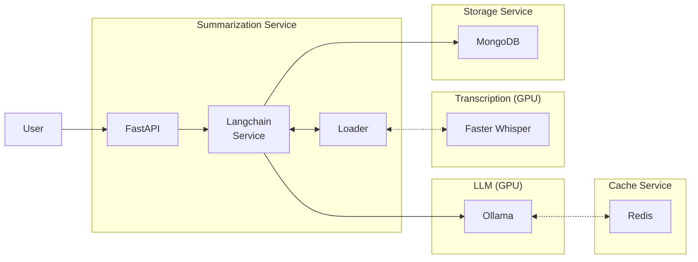

+++
title = 'Langchain Summarization App'
date = 2024-09-15
type = 'docs'
+++


## Introduction

After the discoveries and insights from the [Summarization Suite](summarization-suite/_index.md), I
developed a more robust system in order to combine summarization capabilities across text, audio and video
formats in a single application, this time deployed as an API service.

In this project the different summarization operations performed over different the media formats
were combined using the [Langchain](https://github.com/langchain-ai/langchain) framework along with
many of its integrations with other services and libraries. The final solution consisted of a RESTful
API served via FastAPI with batching/streaming capabilities interacting with a micro-service-based
system deployed in Podman containers. Additionally, all LLM operations, including summarization tasks
were run locally within GPU-capable containers.

Apart from the summarization operations, a simple Feedback machanism was implemented to collect
via the REST API feedbacks for the generated summaries.



  


### Highlights
- [Podman](https://github.com/containers/podman) as container engine for micro-service based deployment
- Streaming capabilities directly via Langchain
- LLM deployment with [Ollama](https://github.com/ollama/ollama) in GPU capable containers (powered by [nvidia container toolkit](https://docs.nvidia.com/datacenter/cloud-native/container-toolkit/latest/index.html))
- [Redis](https://github.com/redis/redis) for LLM response caching
- [MongoDB](https://github.com/mongodb/mongo) for storage solution, storing summaries, metadata and feedbacks
- [FastAPI](https://github.com/fastapi/fastapi) as web framework


## Input Formats

The two main formats processed by the application include text and audio. Langchain makes it easy to
extract the content of a myriad of file formats using its [Document Loaders](https://python.langchain.com/docs/concepts/document_loaders/)
, which act as an initial step in the processing pipeline. The Summarization Service class dynamically
selects the appropriate Loader based on the file type, identified using [`libmagic`](https://github.com/dveselov/python-libmagic). Consequently,
**all files submitted to the service are uploaded as raw binary data**.

Below is an example of an API call in which some file `file.pdf` is uploaded to appropriate endpoint
using [POST requests](https://developer.mozilla.org/en-US/docs/Web/HTTP/Methods/POST).

```bash
$ curl -X POST "http://0.0.0.0:8000/summarize"
    \ -F "file=@file.pdf;type=application/octet-stream"
    \ --no-buffer
```



In addition to Langchain’s built-in Loaders, a custom Document Loader for audio transcription has
been proposed (currently under review in a [PR for the `langchain-community` package](https://github.com/langchain-ai/langchain/pull/26638)).
This PR provides further details and rationale for the integration. For now, suffices to know 
that audio transcription is handled locally but operates independently of the summarization
environment.


## Architecture

The diagram below depics the overall architecture of the application; gray boxes indicate the containers,
while the black boxes indicate the actual services run in each container, dotted lines indicate 
optional communications between services.



### Containers & Components 

The central container, "Summarization Service", orchestrates the processing of documents forwarded
by the FastAPI server. It extracts the content with the appropriate Document Loader, sends the
extracted text over to the LLM service and stores the received summary (and its metadata) in the
Storage Service it is connected to. All commmunication between the services is performed over the
[podman-defined network](https://github.com/containers/podman/blob/main/docs/tutorials/basic_networking.md)
to which all services are connected.

The LLM service runs an instance of [Ollama](https://github.com/ollama/ollama) in a GPU capable
container using the [nvidia container toolkit](https://docs.nvidia.com/datacenter/cloud-native/container-toolkit/latest/index.html).
This service allows us easily change the LLM used in the application while optimizing hardware
utilization as well as other aspects like the number of concurrent inference processes, queue size
limits and the simultaneous loading of multiple models.

The Cache Service uses an instance of Redis integrated with LangChain's LLM abstraction via the
[Redis Langchain integration](https://python.langchain.com/docs/integrations/caches/redis_llm_caching/).
This integration eliminates the need for custom caching logic while preventing redundant calls to
the LLM which is particularly beneficial when using external (paid) LLM services.

The Transcription Service operates in another GPU-capable container (using a different version of CUDA)
running a [`faster-whisper-server`](https://github.com/fedirz/faster-whisper-server) instance,
a containerized runtime for [`faster-whisper`](https://github.com/SYSTRAN/faster-whisper) which is integrated
with Langchain using the [custom Document Loader](https://github.com/langchain-ai/langchain/pull/26638)
mentioned earlier. The decoupling of this service prevents us from adding GPU-heavy dependencies to
the "Summarization Service" container and also simplifies swapping the transcription service, as
it only requires updating the Langchain integration for handling video and audio content.

The Storate Service runs a MongoDB instance responsible for storing:
1) The generated summaries
1) The origingal document as raw binary (*i.e.* as received by the application)
1) LLM generation metadata and other service parameters
1) Feedbacks received for each summary.

Some [integrations from Langchain](https://python.langchain.com/api_reference/mongodb/index.html)
could have been used, but given the specialized nature of the storage schema, an interface
for the application was developed in order to abstract the interactions with the database (and also
making it simple to swap the storage service if needed).


### Execution Flow

The follownig steps describe a high level overview of the operations performed on each
document submitted to the summarization application. Note that given the asynchronous nature of
the system, multiple steps may execute concurrently on different documents.


1) The FastAPI server receives the file as raw binary data via a POST request.
1) The document is temporarily stored locally, and its file path is passed to the Loader for content extraction.
1) The Loader processes the file, extracting its content and converting it into LangChain Documents.
1) The Langchain Runnable component checks the Cache Service for any existing summary of the document to avoid redundant processing.
1) If no cached result is found, the document is forwarded to the LLM service for summarization. The summary is either streamed directly or accumulated for batch responses.
1) The generated summary is then returned to the user through FastAPI, either as a stream or a complete batch, depending on the initial user request.
1) Finally, the original file bytes, the summary and associated metadata are saved in the Storage Service for future reference and/or debugging.


## Streaming & Batching

By design the application utilizes Langchain's streaming capabilities to generate summaries in real
time, sending each chunk back to the user as it is created via FastAPI's
[`StreamingResponse`](https://fastapi.tiangolo.com/advanced/custom-response/#streamingresponse).
Streaming is particularly useful for on-demand summaries as it naturally breaks the summary into
smaller chunks; as a result this reduces the network bandwidth utilization while also enhancing
user experience. The incremental delivery provides a sense of task progress and increases the user
tolerance for latency, making the summarization process more responsive and predictable.

For use cases where real-time streaming is unnecessary — such as batch-processing pipelines that
queue multiple documents for summarization — the application can switch to a batch-oriented execution
mode. In this mode, the entire summary is generated by the LLM and sent as a single response once
processing is complete. This approach is ideal for scenarios prioritizing simplicity or where
network bandwidth and latency are not significant concerns.

Both streaming and batching modes allow the application to adapt flexibly to different workflows,
whether it is being used interactively with the frond-end or as a component in a data processing
pipeline. Regardless of the execution mode triggered, it collects and stores all relevant metadata
in the storage service to ensure proper logging and record-keeping during its operation.

## Data Storage
