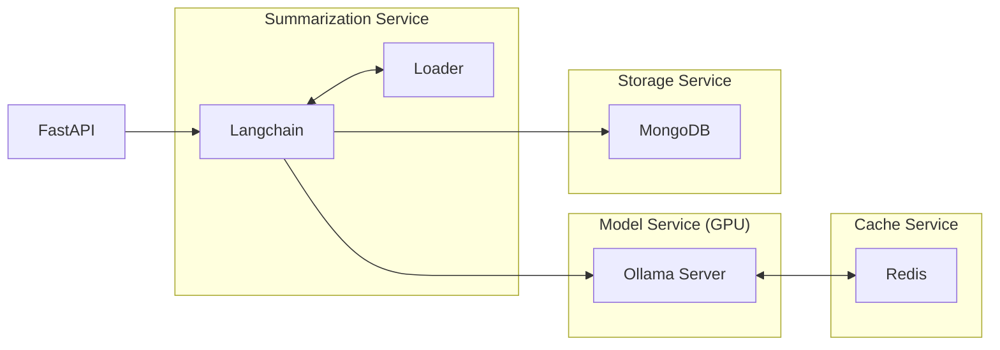
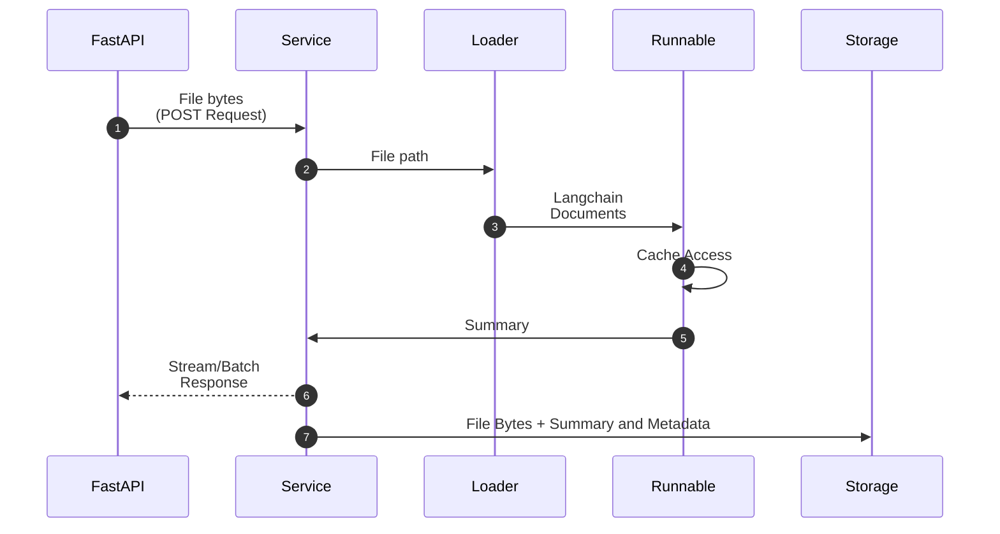

+++
title = 'Multimodal Langchain Summarization App'
date = 2024-09-15
type = 'docs'
+++


## Introduction


## Input Formats


```bash
$ curl -X POST "http://0.0.0.0:8000/summarize"
    \ -F "file=@file.pdf;type=application/octet-stream"
    \ --no-buffer
```


## Architecture



### Componentes and Containers

### Execution Flow




## Streaming & Batching

