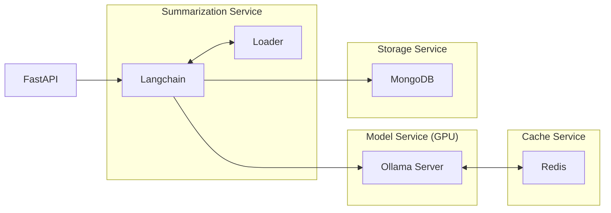
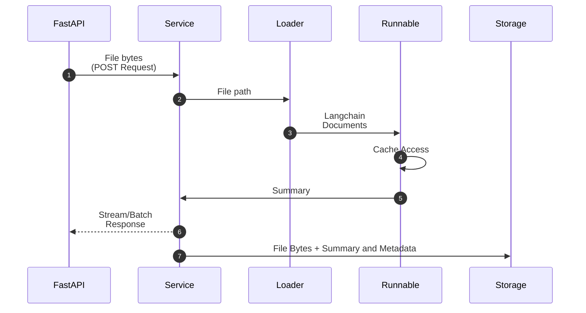

+++
title = 'Multimodal Langchain Summarization App'
date = 2024-09-15
type = 'docs'
+++


## Introduction

After the series of discoveries performed in the [Summarization Suite](summarization-suite/_index.md)
it was time incorporate the individual functionalities into a more robust system. That was also a good
opportunity to modularize and isolate each of the componenta in order to make room for extension later on. 

In this project the different summarization operations performed over text, audio and video formats
were combined using the [Langchain](https://github.com/langchain-ai/langchain) framework along with
many of its several integrations with other services and libraries. The final solution consisted of
a RESTful API served via FastAPI with batching/streaming capabilities interacting with a micro-service-based
system deployed in Podman containers.

Apart from the summarization operations, a simple Feedback machanism was implemented to collect
feedbacks for the generated summaries using the same REST API.


  


### Highlights
- [Podman](https://github.com/containers/podman) as container engine for micro-service based deployment
- Streaming capabilities directly via Langchain
- LLM deployment with [Ollama](https://github.com/ollama/ollama) in GPU capable containers (powered by [nvidia container toolkit](https://docs.nvidia.com/datacenter/cloud-native/container-toolkit/latest/index.html))
- [Redis](https://github.com/redis/redis) for LLM response caching
- [MongoDB](https://github.com/mongodb/mongo) for storage solution
- [FastAPI](https://github.com/fastapi/fastapi) as web framework


## Input Formats


```bash
$ curl -X POST "http://0.0.0.0:8000/summarize"
    \ -F "file=@file.pdf;type=application/octet-stream"
    \ --no-buffer
```


## Architecture



### Componentes and Containers

### Execution Flow



## Streaming & Batching

