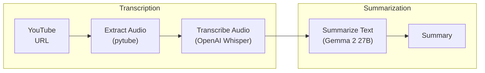

+++
title = 'Video Summarization PoC'
type = 'docs'
sidebar.exclude = true
+++

## Introduction

This project presents a proof-of-concept application designed to automatically summarize YouTube videos through a combination of audio extraction, speech recognition, and text summarization. By utilizing OpenAI’s Whisper for speech-to-text and the Gemma 2 model for summarization, the application efficiently generates concise summaries of video content, making it ideal for a range of video types and lengths.

Even though this project was designed as a proof-of-concept, if you want you can run it locally with the utility script to summarize (almost) any YouTube video.

### Technology Stack

- **Audio Extraction:** [`pytube`](https://pytube.io/en/latest/) and [`pydub`](https://pydub.com/)
- **Speech Recognition:** [OpenAI Whisper](https://github.com/openai/whisper)
- **Text Summarization:** [Gemma 2 27B](https://blog.google/technology/developers/google-gemma-2/) with Q6 Quantization

 


  
  


## Process Overview

The workflow starts with extracting audio from videos using tools like `pytube` and `pydub`. Once the audio is processed, OpenAI’s Whisper is employed to perform speech recognition, converting the audio into text. This transcription is then passed to the Gemma 2 27B model for summarization, producing concise summaries tailored to different video formats, whether short clips or extended recordings.

Check out the [Installation and Usage](https://github.com/lfenzo/poc-video-summarization?tab=readme-ov-file#installation-and-usage) section if would like
to run this project locally.

## Compute Cost Analysis

A computational cost analysis has been conducted to evaluate the VRAM requirements, execution times, and performance of the Whisper model on both GPU and CPU. For detailed findings and methodology, check out the [Computational Cost for Local Execution](https://github.com/lfenzo/poc-video-summarization/blob/main/transcription/README.md).

In summary (pun intended), the study used Brazilian Portuguese videos of varying lengths, grouped into three categories. Results show that VRAM usage remains constant regardless of the audio size, but execution times increase notably with larger models. While CPU execution is possible, it results in significantly longer processing times and is not recommended. Smaller models tend to introduce transcription errors, which larger models can better correct. Additionally, disk storage requirements for audio transcriptions are modest, with approximately 60MB needed for 1 hour of audio. The study highlights that inference times should be a key consideration in practical use cases.

## Future Directions

Opportunities for future improvements include video segmentation, customization options for summary length, and developing a user-friendly interface, containerize the solution to facilitate deploy. This proof of concept opens doors for more advanced implementations in video summarization.
