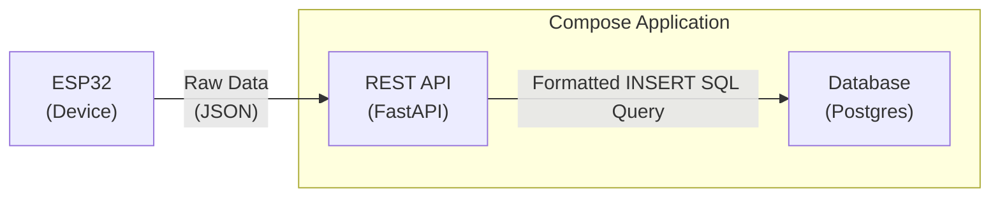

+++
title = 'ESP32 Measurements over LAN'
description = 'A simples prove of concept to send ESP32 collected data over LAN to a database'
date = 2023-03-28T17:29:05-03:00
type = 'docs'
tags = ['IoT']
+++

This project showcases a simple proof of concept using the **ESP32 to collect temperature and humidity
data** and have it sent to a database using local area network (LAN). Its objective was to
instrumentalize data collection by integrating embedded Arduino code with centralized server-side
applications.

The same minimal setup and concept can be abstracted in order to incorporate sensor data ingestion
as a module of larger projects.


  


- **ESP32 Embedded Code:** Establishes a connection to the specified Wi-Fi network and synchronizes the device's clock using NTP. Written in the Arduino language, this code then interacts with the [DHT11 sensor](https://www.mouser.com/datasheet/2/758/DHT11-Technical-Data-Sheet-Translated-Version-1143054.pdf) to collect temperature and humidity readings. It packages the sensor data along with essential metadata - such as the device ID and the data collection timestamp - into a JSON object transmitted as payload over the network to the API `sensor_observations` endpoint.

- **API:** Handles `POST` and `GET` requests directed to the `sensor_observations` endpoint. It processes JSON payloads sent by ESP32 devices, transforming them with `pydantic` into formatted SQL queries. These queries are then inserted into a PostgreSQL database using [`pg8000`](https://pypi.org/project/pg8000/).

- **Database:** A PostgreSQL database preconfigured to store humidity and temperature measurements sent by ESP32 devices. The primary operation involves the initial setup, such as creating the database schema, which is executed once when the container is initialized.
