+++
title = 'Neovim Fusion'
description = "The radioactiva neovim colorscheme (beweare of the radiation!)."
date = 2024-07-16
type = 'blog'
tags = ['neovim', 'text-editor', 'open-source']
+++

## The Radioactive Neovim Colorscheme

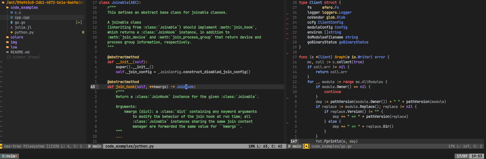

Fusion is a dynamic and visually appealing dark colorscheme plugin for [Neovim](https://neovim.io/), designed to enhance the coding environment with vibrant and harmonious color combinations. Developed with [Lua](https://www.lua.org/), this colorscheme aims to improve code readability and aesthetics while maintaining consistency across different programming languages thanks to [nvim-tree-sitter](https://github.com/nvim-treesitter/nvim-treesitter).

> This project emerged as a result of my miserably failed attempts of finding a dark colorscheme that matched my preferences once I transitioned from vscode with Monokai to Vim and later on Neovim. After countless colorschemes tested I decided to create my own...

## Key Features

- **Consistency:** Emphasizing consistency across different programming/markup languages ensured by Tree Sitter.
- **Rich Color Palette:** Offers a blend of vibrant and subtle colors, making code more readable and visually appealing.
- **Syntax Highlighting:** Supports a wide range of programming languages, ensuring consistent and clear syntax highlighting.

For more installation instructions and other details, visit the [`fusion.nvim` repository](https://github.com/lfenzo/fusion.nvim).

 

# Gallery

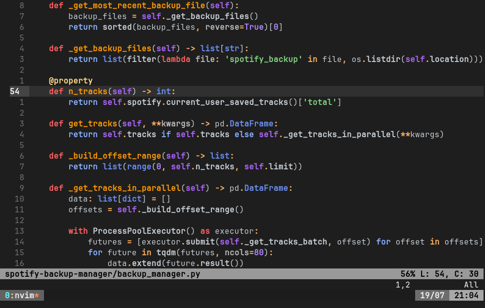
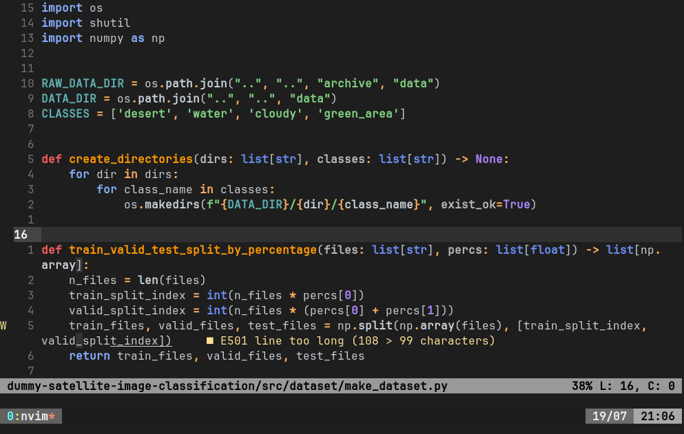
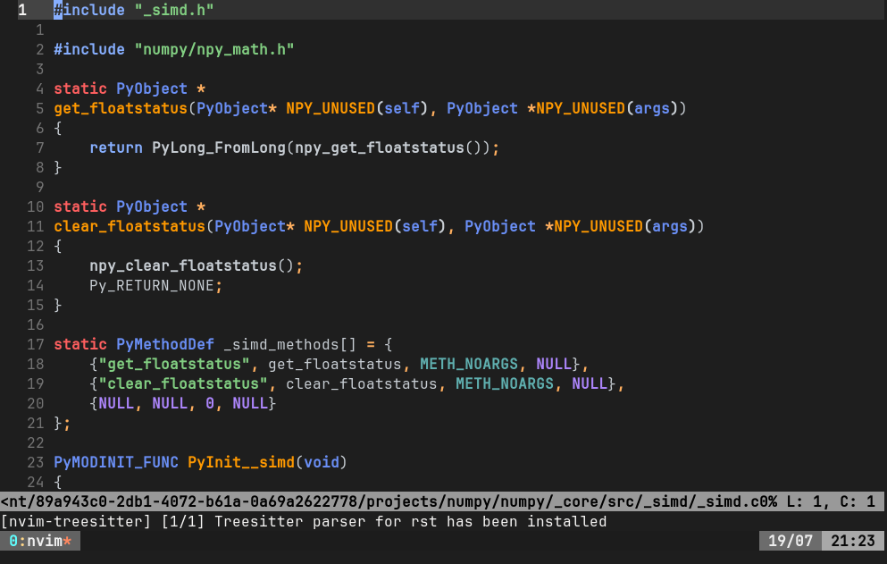
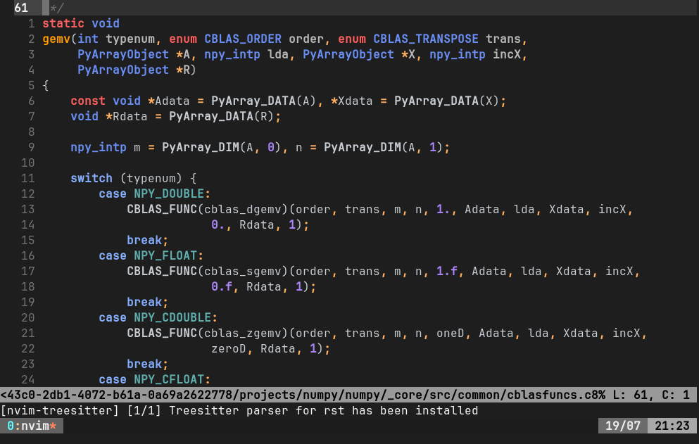
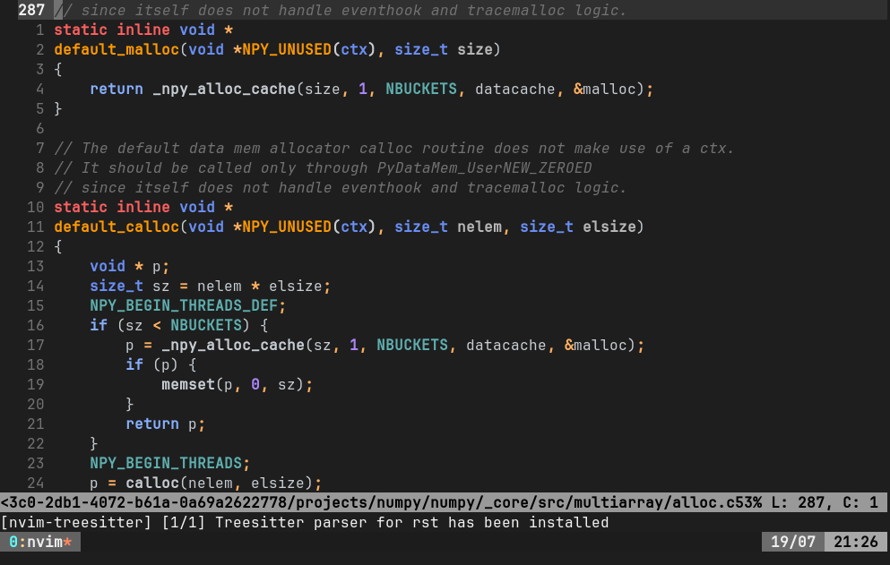
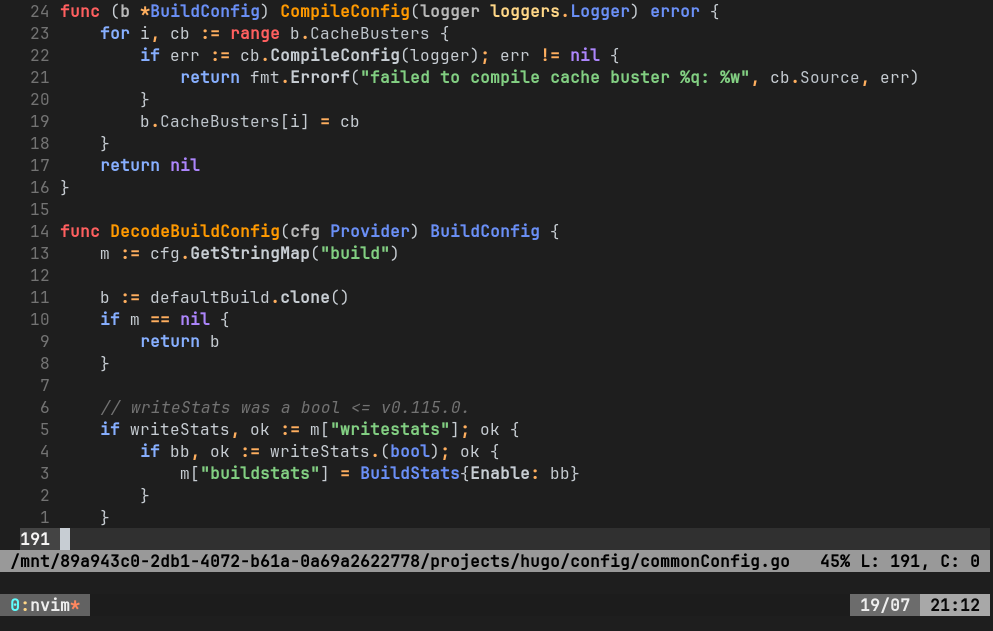
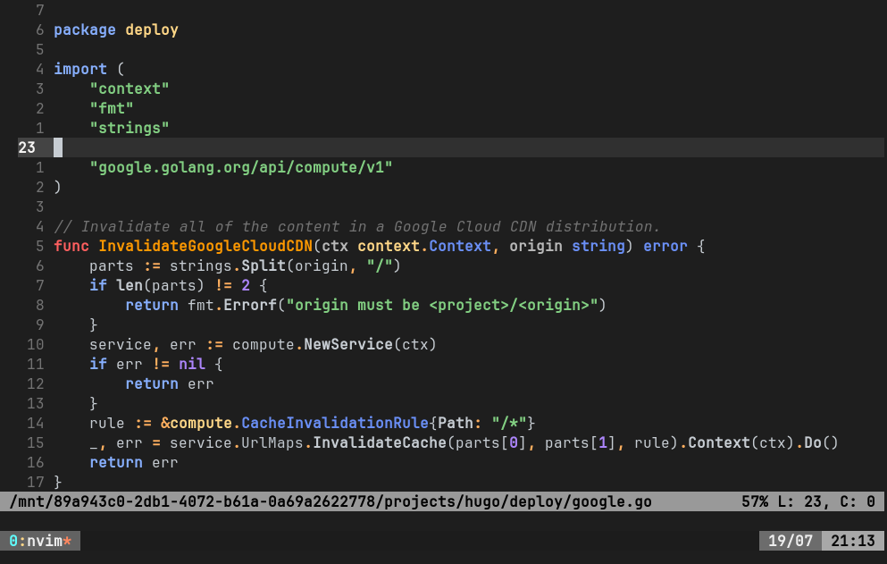
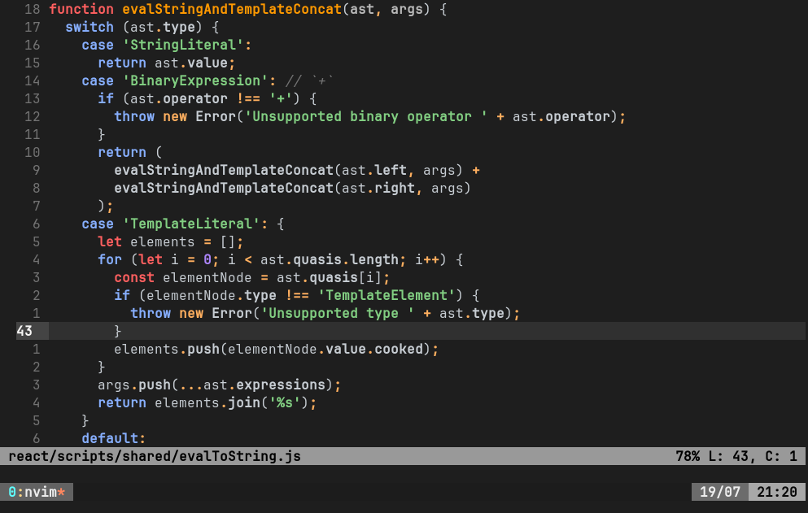
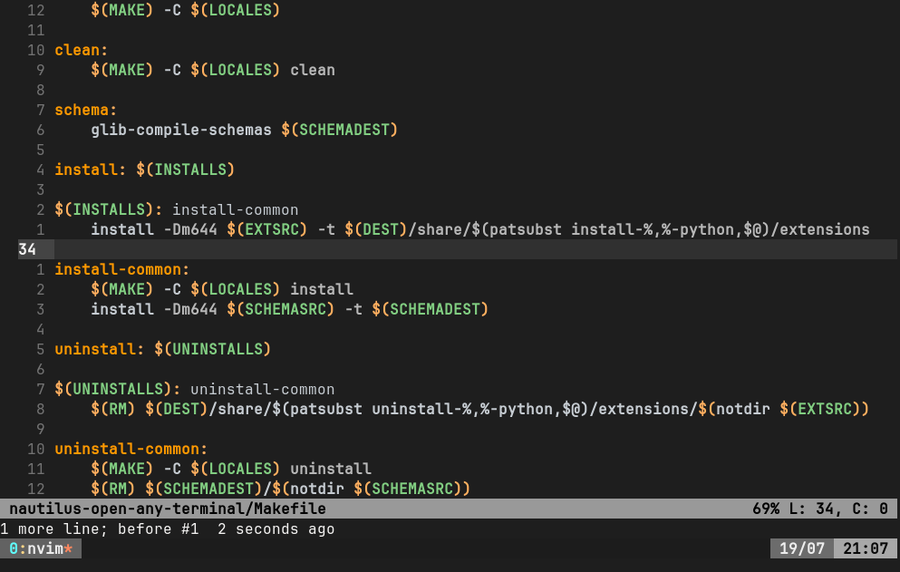
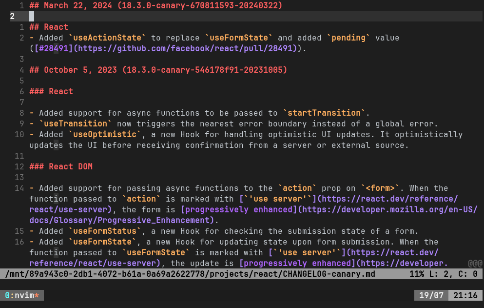
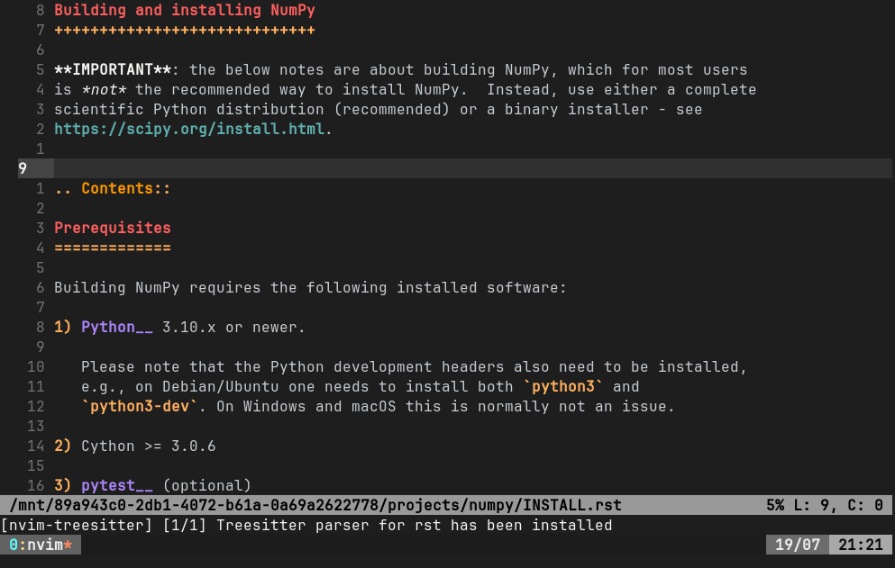
